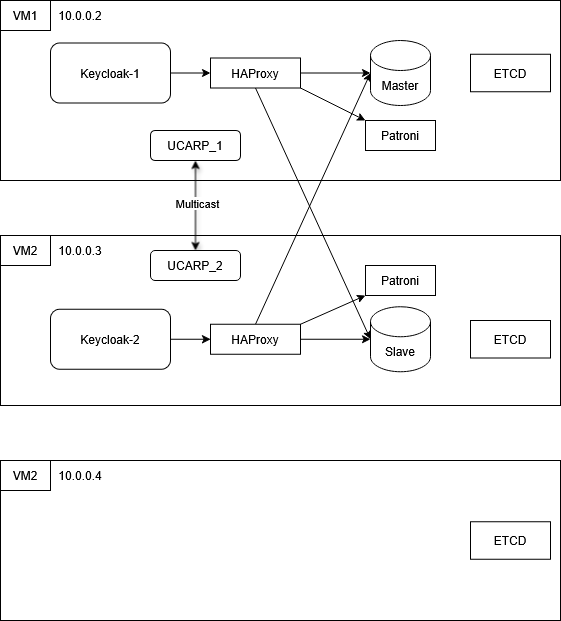

# Keycloak High Availability Cluster

Отказоустойчивый кластер Keycloak с PostgreSQL (Patroni), etcd, HAProxy и UCARP.  
Всё упаковано в Docker, разворачивается одной командой.

## Оглавление

- [Архитектура](#архитектура)
- [Компоненты](#компоненты)
- [Быстрый старт](#быстрый-старт)
- [Конфигурация](#конфигурация)
- [Управление](#Управление)
- [Полезные ссылки](#Полезные-ссылки)

---

## Архитектура



## Компоненты

| Компонент | Технология | Где запущен | Порты |
|-----------|------------|-------------|-------|
| Координатор | etcd | Docker на VM3 | 2379, 2380 |
| База данных | PostgreSQL 16 + Patroni | Docker на VM1, VM2 | 5432, 8008 |
| Приложение | Keycloak 26.1.4 | Docker на VM1, VM2 | 8080 |
| Балансировка | HAProxy | Docker на VM1, VM2 | 80, 8404 |
| Виртуальный IP | UCARP | Хост на VM1, VM2 | — |

## Быстрый старт

### 1. Клонируйте репозиторий

```bash
git clone https://github.com/UnexarT/keycloak-ha.git
cd keycloak-ha
```

### 2. Настройте IP-адреса
Отредактируйте файл .env:
```bash
nano .env
```

Измени первые 6 строк под свою сеть:
```bash
VM1_IP=10.0.0.2   # IP первой VM
VM2_IP=10.0.0.3   # IP второй VM
VM3_IP=10.0.0.4   # IP третьей VM (etcd)
VIP=10.0.0.1      # Свободный IP для VIP
GATEWAY=10.0.0.5    # Шлюз
NETWORK_PREFIX=24
```

### 3. Разверните на каждой VM
Скопируйте папку на каждую VM и запусти:
```bash
# На каждой VM
chmod +x setup.sh
./setup.sh
```
Скрипт автоматически определит роль VM по файлу .env:
| IP | Роль | Что делает |
|----|------|------|
| = VM3_IP |	etcd|	Устанавливает Docker, запускает etcd|
|= VM1_IP или VM2_IP|	app	|Устанавливает Docker, UCARP, запускает все контейнеры|

### 4. Проверка работоспособности
```bash
# Проверка VIP
ip addr show | grep 10.0.0.1

# Проверка Keycloak
curl http://10.0.0.1/realms/master

# Статистика HAProxy
curl http://10.0.0.1:8404/stats
```
Логин для статистики HAProxy: admin / admin123

## Управление
#### Просмотр логов
```bash
# etcd
docker-compose logs etcd

# Patroni
docker-compose logs patroni

# Keycloak
docker-compose logs keycloak

# HAProxy
docker-compose logs haproxy

# UCARP
sudo journalctl -u ucarp -f
```
#### Перезапуск компонентов
```bash
# Перезапуск всех контейнеров
docker-compose restart

# Перезапуск UCARP
sudo systemctl restart ucarp

# Полный перезапуск системы
sudo reboot
```
#### Проверка состояния кластера PostgreSQL
```bash
sudo docker exec -it patroni patronictl list
```
Пример вывода:
```text
+ Cluster: keycloak_db (7616576015503556902) ----+----+-----------+
| Member | Host            | Role    | State     | TL | Lag in MB |
+--------+-----------------+---------+-----------+----+-----------+
| vm1    | 192.168.182.133 | Leader  | running   | 17 |           |
| vm2    | 192.168.182.134 | Replica | streaming | 17 |         0 |
+--------+-----------------+---------+-----------+----+-----------+
```

#### Доступ к Keycloak Admin Console
Открой в браузере: http://10.0.0.1/admin

Логин: admin
Пароль: из .env (по умолчанию admin123)

## Полезные ссылки
- [Keycloak Documentation](https://www.keycloak.org/documentation)
- [Patroni Documentation](https://patroni.readthedocs.io/en/latest/)
- [etcd Documentation](https://etcd.io/docs/)
- [HAProxy Documentation](https://www.haproxy.org/#docs)
- [UCARP GitHub](https://github.com/jedisct1/UCarp)
